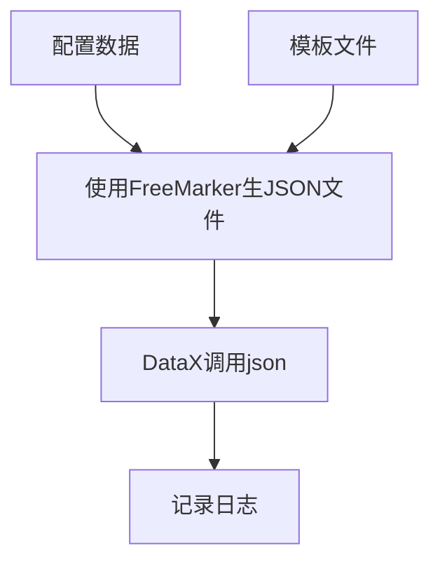

# datax-script

DataX非最佳实践。

## 写在前面

这里主要是说一下为什么要写这个项目。

刚学习完`DataX`，想用`DataX`解决一些实际项目中遇到到问题。先说说需求吧。业务系统大概有10多个不同的数据库，要做的就是从10多个不同的数据库中，每个数据库抽取部分表到数据分析系统中（以下简称`A`数据库），大概每个数据库需要抽100张表左右。架构如下。

```bash
各个业务系统    	  -->     数据分析系统
databaseA (100张表)----|
                      |
databaseB (100张表)----|	
                      |
databaseC (100张表)----|
                      |
databaseD (100张表)----| =====> A数据库
                      |
databaseE (100张表)----|
                      |
databaseF (100张表)----|
                      |
databaseG (100张表)----|
```

**问题一：**

`DataX`实现数据同步的方式是通过调用 `python {Datax_PATH}/bin/datax.py  {Job_PATH}/job/xxx.json` 命令来执行作业的，那么如果要实现上述的需求，假设每个数据库抽取100张表，总共就是700张表。如果一两个手动配就完事了，但是如果有上百个，手动配的话可太麻烦了。最愚蠢的做法，你需要为此创建700个json文件。并为每个json文件写一条调用命令，而后你可以把这些命令都塞到一个`.sh`文件里面，再通过系统定时的执行实现定时抽取。类似的`.sh`文件写法可能如下：

```shell
python {Datax_PATH}/bin/datax.py  {Job_PATH}/job/tab_1.json
python {Datax_PATH}/bin/datax.py  {Job_PATH}/job/tab_2.json
python {Datax_PATH}/bin/datax.py  {Job_PATH}/job/tab_3.json
python {Datax_PATH}/bin/datax.py  {Job_PATH}/job/tab_4.json
python {Datax_PATH}/bin/datax.py  {Job_PATH}/job/tab_5.json
python {Datax_PATH}/bin/datax.py  {Job_PATH}/job/tab_6.json
python {Datax_PATH}/bin/datax.py  {Job_PATH}/job/tab_7.json
python {Datax_PATH}/bin/datax.py  {Job_PATH}/job/tab_8.json
......
```

**问题二：**

日志问题：`DataX`执行的时候会在控制台打印执行日志，并把日志写入到`datax/log`目录下面。但是在实际项目使用中，是不允许随时登录到机器上去查看日志文件的，且日志文件也不利于日常的抽取监控，所以需要把执行的结果写入到数据库中，通过前端查询数据库表来监控抽取情况。但`DataX`并未提供类似接口来实现此操作。

**问题三：**

数据迁移问题：针对于上面的两个问题，现在成熟的解决方案目测是 [DataX-Web](https://gitee.com/WeiYe-Jing/datax-web) ，应该能解决上述问题，但有一个问题，所有的日志及配置都是存在于`MySQL`数据库中，我们现有项目使用的是`DB2`数据库，如果要满足现有需求（把日志及配置写入DB2数据库），铁定是需要二次开发的。PS：要二开别人的项目，难度还是很大的，不知道要踩多少坑。虽然此项目也是也是使用`MySQL`来存储配置文件，但是程序逻辑简单，二开很容易。

> 基于以上的问题，想着自己写一个小程序，来解决这些问题。才有了此项目。


## 基本介绍

**能做什么**：

- 根据配置+模板，批量生成`DataX`执行所需要的`JSON`文件。
- 根据配置，批量执行`DataX`命令。
- 详细的日志记录，写入到数据库保存。方便查看、迁移。
- 列自动同步，第一次执行只需要配置“*”，即可自动用目标端的列信息更新配置。

## 软件架构

- 执行流程图如下（因为我没有图床，本地图片你们看不到，就用这种方式画图了，`git`上可能渲染不了流程图，建议用`Typora`打开即可查看流程图）。



- 再画一个吧

```|
配置数据 =\
          ==> 使用FreeMarker生JSON文件 ==> DataX调用JSON ==> 记录日志
模板文件 =/
```

执行流程为：程序先查询数据库的配置数据，使用`FreeMarker`根据配置数据+模板，生成供`DataX`执行的JSON文件，并使用`DataX`执行此JSON，执行作业，作业完成之后写入日志到日志表中。如果有多条配置，按照顺序重复此操作。


## 快速启动

- 将带你从零开始搭建一个环境，从而让你快速熟悉`DataX-Script`的使用姿势。
- liunx：[入门示例](https://gitee.com/long-zhangming/datax-script/blob/master/doc/%E5%85%A5%E9%97%A8%E7%A4%BA%E4%BE%8B.md)


## 使用说明

### 配置表信息详解

每个字段什么意思，有什么作用


### 扩展

现在只是关系型数据库，如果其他数据源怎么办，模板怎么写，表怎么扩字段


## 待做事项

可以搞个打印字符画，打印一下 `Datax_script`字符。

测试一下，如果源表跟目标表的字段不一样，配置为*，第一次肯定会抽取失败的，测试一下会不会把落地端的字段给更新上去。


## 参与贡献

1.  Fork 本仓库
2.  新建 Feat_xxx 分支
3.  提交代码
4.  新建 Pull Request
